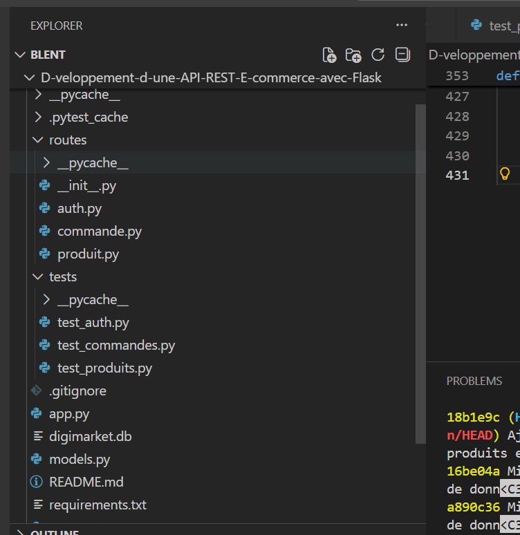

# API REST E-Commerce avec Flask

## Présentation

Développement une API REST pour une application de commerce électronique avec **Python, Flask SQLite**.

L'API permet de gérer les utilisateurs, les produits et les commandes. en se basan sur une authentification par JWT ainsi qu'une gestion des rôles entre les utilisateurs **client** et **administrateur**.


---

## Technologies utilisées

- Python 3
- Flask
- Flask-SQLAlchemy
- SQLite
- PyJWT
- Werkzeug
- pytest

---

## Fonctionnalités

1. Authentification

L'API permet :

- de créer un utilisateur ;
- de se connecter avec une adresse e-mail et un mot de passe ;
- de générer un token JWT lors de la connexion ;
- de gérer deux rôles :
  - `client`
  - `admin`
-de Hasher les mots de passe

Les routes nécessitant une authentification utilisent le token JWT transmis dans l'en-tête `Authorization`.

---

2. Gestion des produits

L'API permet de :

- consulter la liste des produits ;
- consulter un produit par son identifiant ;
- ajouter un produit ;
- modifier la quantité en stock ;
- supprimer un produit.

La consultation des produits est accessible sans authentification.

Les opérations de création, modification et suppression (CRUD) sont réservées aux administrateurs.

---

3. Gestion des commandes

L'API permet de :

- créer une commande ;
- consulter les commandes ;
- consulter une commande par son identifiant ;
- ajouter des produits à une commande ;
- modifier le statut d'une commande.

Un client peut uniquement gérer ses propres commandes.

Un administrateur peut consulter et gérer les commandes selon les règles définies dans l'API.

---

4. Gestion du stock

Lorsqu'un administrateur valide une commande :

1. l'API vérifie que les produits demandés sont disponibles ;
2. si le stock est suffisant, la commande est validée ;
3. la quantité disponible est diminuée ;
4. si le stock est insuffisant, la validation est refusée ;
5. le stock reste inchangé lorsque la validation échoue.

---

4. Statuts des commandes

Les statuts utilisés par l'API sont :

- `en attente`
- `validée`
- `expédiée`
- `annulée`

---

5. Base de données

Le projet utilise une base de données SQLite nommée :


digimarket.db

Elle contient notamment les tables :

- `user`
- `product`
- `order`
- `order_item`

La base de données est utilisée directement par l'application et par les tests pytest.
Pour faire un test complet lancer la commande

---

## Installation

### 1. Cloner le projet

```bash
git clone https://github.com/Midepani/D-veloppement-d-une-API-REST-E-commerce-avec-Flask.git
```

### 2. Se placer dans le projet

```bash
cd D-veloppement-d-une-API-REST-E-commerce-avec-Flask
```

### 3. Installer les dépendances

```bash
pip install -r requirements.txt
```

---

## Lancement de l'application

Pour démarrer l'API :

```bash
python app.py
```

L'application Flask peut ensuite être testée avec un outil comme Postman ou directement avec les tests automatisés.

---

## Tests

Le projet utilise **pytest** pour réaliser des tests automatisés.

Les tests couvrent actuellement :

- l'authentification ;
- la connexion d'un client ;
- la connexion d'un administrateur ;
- les erreurs d'authentification ;
- la consultation des produits ;
- la création, modification et suppression des produits ;
- les droits d'accès client / administrateur ;
- la création des commandes ;
- l'ajout de produits aux commandes ;
- la consultation des commandes ;
- la validation des commandes ;
- la gestion du stock ;
- le contrôle du stock insuffisant.

### Exécuter tous les tests

Depuis la racine du projet :

```bash
python -m pytest -v
```

### Résultat actuel

La suite de tests contient actuellement **24 tests**.

```text
24 passed


Tests unitaire sur le l'authentification:

 Authentification
- POST /api/auth/register
- POST /api/auth/login
- mauvais mot de passe
- utilisateur inexistant
- vérification des rôles client / admin

PI-REST-E-commerce-avec-Flask$ python -m pytest tests/test_auth.py -v
================= test session starts =================
platform linux -- Python 3.13.0, pytest-9.1.1, pluggy-1.6.0 -- /usr/bin/python
cachedir: .pytest_cache
rootdir: /home/blent/D-veloppement-d-une-API-REST-E-commerce-avec-Flask
collected 4 items                                     

tests/test_auth.py::test_login_client PASSED    [ 25%]
tests/test_auth.py::test_login_admin PASSED     [ 50%]
tests/test_auth.py::test_mauvais_mot_de_passe PASSED [ 75%]
tests/test_auth.py::test_utilisateur_inexistant PASSED [100%]

================== warnings summary ===================
tests/test_auth.py::test_login_client
tests/test_auth.py::test_login_admin
  /home/blent/D-veloppement-d-une-API-REST-E-commerce-avec-Flask/routes/auth.py:54: DeprecationWarning: datetime.datetime.utcnow() is deprecated and scheduled for removal in a future version. Use timezone-aware objects to represent datetimes in UTC: datetime.datetime.now(datetime.UTC).
    "exp": datetime.utcnow() + timedelta(hours=1),

-- Docs: https://docs.pytest.org/en/stable/how-to/capture-warnings.html
============ 4 passed, 2 warnings in 0.73s ============
blent@workspace-586f1d14fb035d58:~/D-veloppement-d-une-
API-REST-E-commerce-avec-Flask$ 

Commade utilisée: python -m pytest tests/test_auth.py -v

Tests unitaire sur le Produit: 
     Produits
- GET /api/produits
- GET /api/produits/<id>
- produit inexistant → 404
- création produit → admin
- modification produit → admin
- modification stock → admin
- suppression produit → admin
- tentative client → 403

blent@workspace-4d05797e361161ef:~/D-veloppement-d-une-
API-REST-E-commerce-avec-Flask$ python -m pytest tests/test_produits.py -v
================= test session starts =================
platform linux -- Python 3.13.0, pytest-9.1.1, pluggy-1.6.0 -- /usr/bin/python
cachedir: .pytest_cache
rootdir: /home/blent/D-veloppement-d-une-API-REST-E-commerce-avec-Flask
collected 8 items                                     

tests/test_produits.py::test_liste_produits PASSED [ 12%]
tests/test_produits.py::test_produit_existant PASSED [ 25%]
tests/test_produits.py::test_produit_inexistant PASSED [ 37%]
tests/test_produits.py::test_client_ne_peut_pas_ajouter_produit PASSED [ 50%]
tests/test_produits.py::test_admin_peut_ajouter_produit PASSED [ 62%]
tests/test_produits.py::test_admin_peut_modifier_stock PASSED [ 75%]
tests/test_produits.py::test_client_ne_peut_pas_modifier_stock PASSED [ 87%]
tests/test_produits.py::test_admin_peut_supprimer_produit PASSED [100%]

================== warnings summary ===================
tests/test_produits.py::test_client_ne_peut_pas_ajouter_produit
tests/test_produits.py::test_admin_peut_ajouter_produit
tests/test_produits.py::test_admin_peut_modifier_stock
tests/test_produits.py::test_client_ne_peut_pas_modifier_stock
tests/test_produits.py::test_admin_peut_supprimer_produit
  /home/blent/D-veloppement-d-une-API-REST-E-commerce-avec-Flask/routes/auth.py:54: DeprecationWarning: datetime.datetime.utcnow() is deprecated and scheduled for removal in a future version. Use timezone-aware objects to represent datetimes in UTC: datetime.datetime.now(datetime.UTC).
    "exp": datetime.utcnow() + timedelta(hours=1),

tests/test_produits.py::test_admin_peut_ajouter_produit
  /home/blent/.local/lib/python3.13/site-packages/sqlalchemy/sql/schema.py:3627: DeprecationWarning: datetime.datetime.utcnow() is deprecated and scheduled for removal in a future version. Use timezone-aware objects to represent datetimes in UTC: datetime.datetime.now(datetime.UTC).
    return util.wrap_callable(lambda ctx: fn(), fn)  # type: ignore

-- Docs: https://docs.pytest.org/en/stable/how-to/capture-warnings.html
============ 8 passed, 6 warnings in 1.04s ============
blent@workspace-4d05797e361161ef:~/D-veloppement-d-une-
API-REST-E-commerce-avec-Flask$ 


Tests unitaire sur la commande
- création d'une commande → POST /api/commandes
- création pour un autre utilisateur → 403
- ajout d'un produit
- produit inexistant → 404
- quantité invalide → 400
- consultation de l'historique
- client ne voit que ses commandes
- admin voit toutes les commandes

python -m pytest -v
================= test session starts =================
platform linux -- Python 3.13.0, pytest-9.1.1, pluggy-1.6.0 -- /usr/bin/python
cachedir: .pytest_cache
rootdir: /home/blent/D-veloppement-d-une-API-REST-E-commerce-avec-Flask
collected 24 items                                    

tests/test_auth.py::test_login_client PASSED    [  4%]
tests/test_auth.py::test_login_admin PASSED     [  8%]
tests/test_auth.py::test_mauvais_mot_de_passe PASSED [ 12%]
tests/test_auth.py::test_utilisateur_inexistant PASSED [ 16%]
tests/test_commandes.py::test_client_peut_voir_ses_commandes PASSED [ 20%]
tests/test_commandes.py::test_client_recoit_une_liste_de_commandes PASSED [ 25%]
tests/test_commandes.py::test_client_peut_voir_une_commande PASSED [ 29%]
tests/test_commandes.py::test_commande_inexistante PASSED [ 33%]
tests/test_commandes.py::test_client_peut_creer_une_commande PASSED [ 37%]
tests/test_commandes.py::test_client_ne_peut_pas_creer_commande_pour_un_autre_utilisateur PASSED [ 41%]
tests/test_commandes.py::test_client_peut_ajouter_produit_commande PASSED [ 45%]
tests/test_commandes.py::test_ajout_produit_avec_quantite_invalide PASSED [ 50%]
tests/test_commandes.py::test_ajout_produit_inexistant PASSED [ 54%]
tests/test_commandes.py::test_client_ne_peut_pas_valider_commande PASSED [ 58%]
tests/test_commandes.py::test_admin_peut_valider_commande_et_reduire_stock PASSED [ 62%]
tests/test_commandes.py::test_admin_ne_peut_pas_valider_si_stock_insuffisant PASSED [ 66%]
tests/test_produits.py::test_liste_produits PASSED [ 70%]
tests/test_produits.py::test_produit_existant PASSED [ 75%]
tests/test_produits.py::test_produit_inexistant PASSED [ 79%]
tests/test_produits.py::test_client_ne_peut_pas_ajouter_produit PASSED [ 83%]
tests/test_produits.py::test_admin_peut_ajouter_produit PASSED [ 87%]
tests/test_produits.py::test_admin_peut_modifier_stock PASSED [ 91%]
tests/test_produits.py::test_client_ne_peut_pas_modifier_stock PASSED [ 95%]
tests/test_produits.py::test_admin_peut_supprimer_produit PASSED [100%]

================== warnings summary ===================
tests/test_auth.py: 2 warnings
tests/test_commandes.py: 14 warnings
tests/test_produits.py: 5 warnings
  /home/blent/D-veloppement-d-une-API-REST-E-commerce-avec-Flask/routes/auth.py:54: DeprecationWarning: datetime.datetime.utcnow() is deprecated and scheduled for removal in a future version. Use timezone-aware objects to represent datetimes in UTC: datetime.datetime.now(datetime.UTC).
    "exp": datetime.utcnow() + timedelta(hours=1),

tests/test_commandes.py::test_client_peut_creer_une_commande
tests/test_commandes.py::test_client_peut_ajouter_produit_commande
tests/test_commandes.py::test_ajout_produit_avec_quantite_invalide
tests/test_commandes.py::test_ajout_produit_inexistant
tests/test_commandes.py::test_client_ne_peut_pas_valider_commande
tests/test_commandes.py::test_admin_peut_valider_commande_et_reduire_stock
tests/test_commandes.py::test_admin_ne_peut_pas_valider_si_stock_insuffisant
tests/test_produits.py::test_admin_peut_ajouter_produit
  /home/blent/.local/lib/python3.13/site-packages/sqlalchemy/sql/schema.py:3627: DeprecationWarning: datetime.datetime.utcnow() is deprecated and scheduled for removal in a future version. Use timezone-aware objects to represent datetimes in UTC: datetime.datetime.now(datetime.UTC).
    return util.wrap_callable(lambda ctx: fn(), fn)  # type: ignore

-- Docs: https://docs.pytest.org/en/stable/how-to/capture-warnings.html
=========== 24 passed, 29 warnings in 3.08s ===========
blent@workspace-4d05797e361161ef:~/D-veloppement-d-une-
API-REST-E-commerce-avec-Flask$ 

Les tests peuvent modifier les données de digimarket.db (création de commandes, modification du stock, ajout et suppression de produits).

Après avoir exécuté les tests, pour remettre la base de données dans l'état du dernier commit Git, utiliser :

git restore digimarket.db

Pour vérifier que la base a bien été restaurée :

git status

Le résultat attendu est :

nothing to commit, working tree clean

---

## Structure du projet

```text
D-veloppement-d-une-API-REST-E-commerce-avec-Flask/
│
├── app.py
├── models.py
├── digimarket.db
├── requirements.txt
├── README.md
│
├── routes/
│   ├── auth.py
│   ├── produit.py
│   └── commande.py
│
└── tests/
    ├── test_auth.py
    ├── test_produits.py
    └── test_commandes.py
```



---

## Sécurité

L'API utilise plusieurs mécanismes de sécurité :

- authentification par JWT ;
- contrôle des rôles client / administrateur ;
- vérification des droits d'accès aux commandes ;
- mots de passe stockés sous forme de hash ;
- utilisation de SQLAlchemy pour l'accès à la base de données.

---

